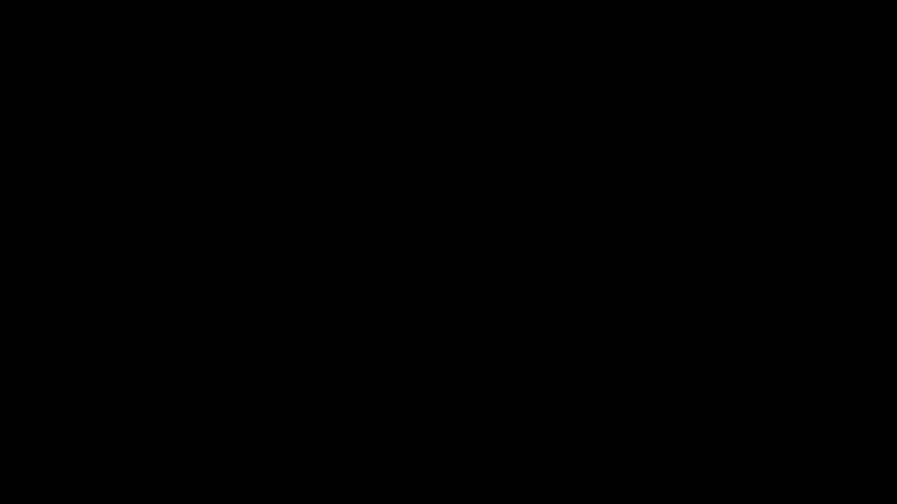

# Flathub Manager / Flatpak 图形管理器

[中文](#中文) | [English](#english)

---

## 中文

**Flathub Manager** 是一个基于 **Bash + Zenity** 的轻量级 Flatpak 图形管理器，适合 Raspberry Pi、ClockworkPi、轻量级 Linux 桌面环境和资源较小的设备使用。

它提供一个简单的图形界面，用于查看 Flatpak 应用、应用依赖运行时、孤立运行时和 Flatpak 保留运行时，并支持安全卸载应用与清理未使用运行时。

### 截图



### 功能

- 图形界面显示已安装 Flatpak 应用和运行时
- 按类别分组显示：
  - 应用依赖关系
  - 孤立运行时
  - Flatpak 保留运行时
- 显示以下信息：
  - 应用 ID
  - 版本 / 分支
  - 类型
  - 状态
  - 运行时 / 归属
  - 大小
  - 安装时间
- 支持卸载 Flatpak 应用
- 支持清理孤立运行时
- 孤立运行时清理使用 Flatpak 官方命令：
  ```bash
  flatpak uninstall --unused
  ```
- 应用依赖运行时不允许单独卸载
- Flatpak 保留运行时不允许直接卸载
- system 安装的卸载操作支持 pkexec 授权
- 操作完成后自动重新打开管理器窗口

### 安全设计

- 不自行猜测哪些运行时可以删除
- 孤立运行时由 Flatpak 官方 `flatpak uninstall --unused` 判断
- 应用依赖运行时不会被单独卸载
- Flatpak 保留运行时不会被直接卸载
- 卸载应用后，会询问是否清理未使用运行时
- 清理运行时时由 Flatpak 自己判断可清理项目

### 依赖

- bash
- flatpak
- zenity
- python3
- coreutils
- pkexec，可选，用于 system 安装卸载授权

Debian / Ubuntu 可安装依赖：
```bash
sudo apt update
sudo apt install -y flatpak zenity python3 coreutils policykit-1
```

### 安装

```bash
mkdir -p ~/.local/bin
cp flathub-manager.sh ~/.local/bin/flathub-manager.sh
chmod +x ~/.local/bin/flathub-manager.sh
```

或者使用安装脚本：
```bash
./install.sh
```

### 运行

```bash
~/.local/bin/flathub-manager.sh
```

### 适用场景

- 想用图形界面查看 Flatpak 应用和运行时
- 想安全卸载 Flatpak 应用
- 想清理 Flatpak 判断为未使用的运行时
- 想在轻量级设备上避免安装大型软件中心

---

## English

**Flathub Manager** is a lightweight Flatpak GUI manager built with **Bash + Zenity**. It is designed for Raspberry Pi, ClockworkPi, lightweight Linux desktops, and low-resource devices.

It provides a simple graphical interface for viewing Flatpak apps, app runtime dependencies, unused runtimes, and reserved Flatpak runtimes. It also supports safe app removal and cleanup of unused runtimes.

### Screenshot


### Features

- Graphical list of installed Flatpak apps and runtimes
- Grouped display:
  - App dependency relationships
  - Unused runtimes
  - Reserved Flatpak runtimes
- Displays:
  - App ID
  - Version / branch
  - Type
  - Status
  - Runtime / owner
  - Size
  - Install time
- Supports uninstalling Flatpak apps
- Supports cleaning unused runtimes
- Runtime cleanup uses the official Flatpak command:
  ```bash
  flatpak uninstall --unused
  ```
- App dependency runtimes cannot be removed directly
- Reserved Flatpak runtimes cannot be removed directly
- System-level uninstall operations support pkexec
- The manager window reopens automatically after successful operations

### Safety Design

- The tool does not guess which runtimes are safe to remove
- Unused runtimes are determined by Flatpak itself via `flatpak uninstall --unused`
- App dependency runtimes are not removed directly
- Reserved Flatpak runtimes are not removed directly
- After uninstalling an app, the tool asks whether to clean unused runtimes
- Runtime cleanup is delegated to Flatpak

### Requirements

- bash
- flatpak
- zenity
- python3
- coreutils
- pkexec, optional, for system-level uninstall authorization

Install dependencies on Debian / Ubuntu:
```bash
sudo apt update
sudo apt install -y flatpak zenity python3 coreutils policykit-1
```

### Installation

```bash
mkdir -p ~/.local/bin
cp flathub-manager.sh ~/.local/bin/flathub-manager.sh
chmod +x ~/.local/bin/flathub-manager.sh
```

Or use the installer:
```bash
./install.sh
```

### Usage

```bash
~/.local/bin/flathub-manager.sh
```

### Use Cases

- View Flatpak apps and runtimes in a lightweight GUI
- Safely uninstall Flatpak apps
- Clean runtimes that Flatpak reports as unused
- Avoid installing a large software center on lightweight devices
